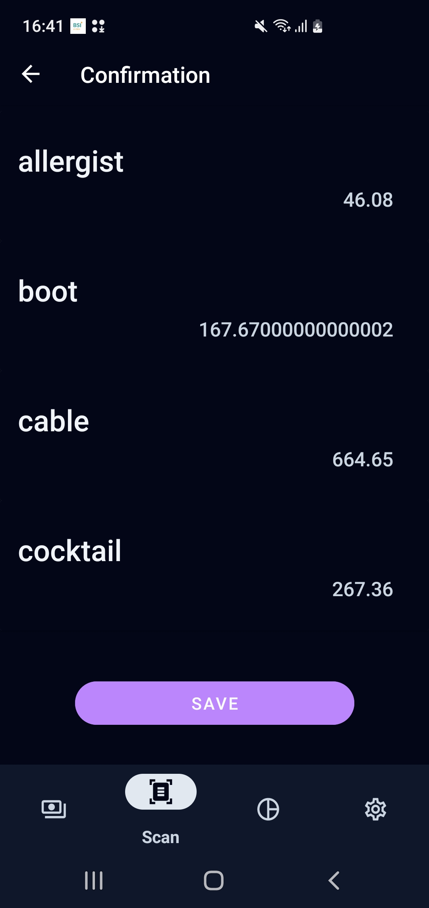

# Tugas Besar 1 IF3210 Platform-Based Development

## Deskripsi Aplikasi
Bondoman adalah aplikasi berbasis android untuk mencatat laporan keuangan dengan beberapa fitur berikut:

- Login untuk masuk ke dalam akun
- Add Transactions : Menambahkan transaksi yang akan dicatat nantinya, terdapat 2 kategori yaitu pemasukan dan pengeluaran
- Scan Bills : Fitur untuk scan suatu bill transaksi dan secara otomatis akan membuat transaksi baru
- Transaction Graph : Fitur yang akan menampilkan graf lingkaran yg berisi perbandingan dari pemasukan dan pengeluaran
- Save Transactions : Menyimpan riwayat transaksi dalam bentuk .xls atau .xlsx
- Send Transactions : Mengirim riwayat transaksi ke email
- Randomize Transactions : Fitur untuk membuat transaksi random

## Library yang digunakan
Room untuk local database sqlite
MpandroidChart untuk pemodelan chart
Google play service location untuk menggunakan layanan lokasi
Google play service maps untuk mengintegrasikan peta Google pada Android
Retrofit untuk pemanggilan jaringan HTTP pada Android
OkHttp Logging Interceptor merupakan interceptor untuk logging di OkHttp yang digunakan Retrofit
JJWT untuk pengimplementasian JSON Web Tokens (JWT) pada Kotlin
CameraX untuk dapat menggunakan kamera
dan untuk seterusnya detail mengenai semua library yang dipakai dapat dilihat pada file build.gradle

## Pembagian Kerja
- 13521001 - Angger Ilham Amanullah 
  - Pembuatan database
  - Pembuatan penembakan endpoint
  - Pembuatan Graph

- 13521005 - Kelvin Rayhan Alkarim
  - Pembuatan kamera
  - Pembuatan transaksi
  - Pembuatan Frontend
  - Refactor Program

- 13521023 - Kenny Benaya Natan
  - Pembuatan navbar
  - Pembuatan desain UI/UX
  - Pembuatan settings
  - Refactor program

## Total Jam Persiapan dan Pengerjaan
Untuk setiap anggota perkiraan rata rata total jam persiapan dan pengerjaan adalah 40 jam dimulai dari tugas besar ini release

## ScreenShot Aplikasi

